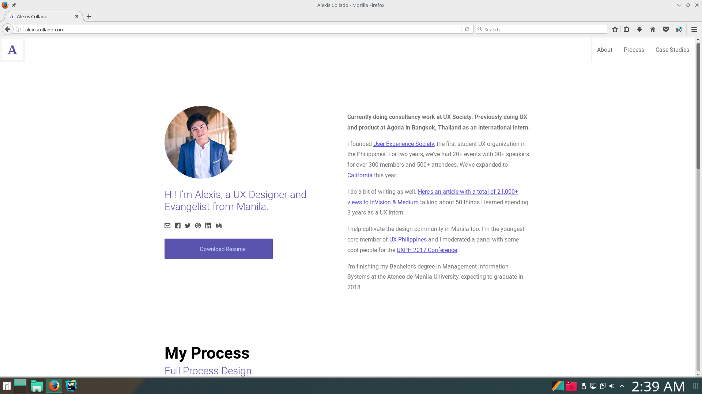

# Lodi Theme

This theme is a Hugo port of [Alexis Collado's portfolio website](www.alexiscollado.com). It is meant to be a single-page responsive theme, with sections for describing yourself, your 
process, and some case studies.



## Installation

Follow the themes guide on the [Hugo website](https://gohugo.io/themes/installing-and-using-themes/). Briefly, within your Hugo folder:

```sh
$ cd themes
$ git clone https://github.com/xaviablaza/hugo-lodi-theme.git
```

## Getting started

Copy `exampleSite/config.toml` into the root of your website folder, and edit it to your hearts content!

Add `theme = "hugo-lodi-theme"` to this config, or when serving, use `hugo server -t hugo-lodi-theme`

## Credits

Credits for this theme goes fully to Alexis Collado, UX design lodi and cofounder of the User Experience Society. More werpa to you.
